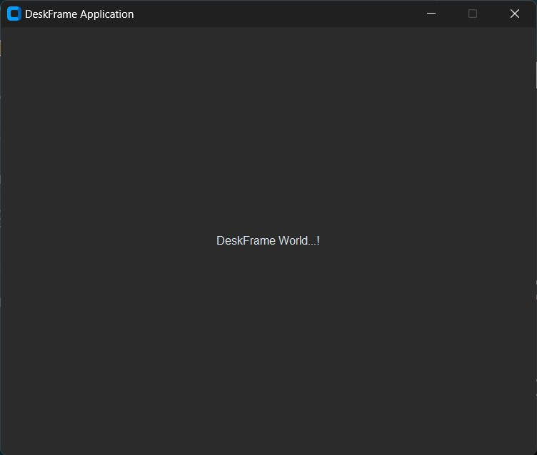
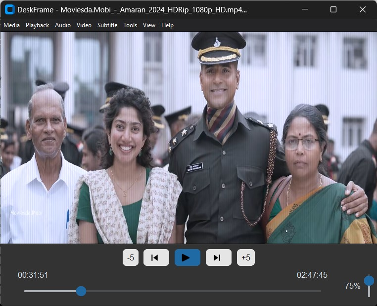
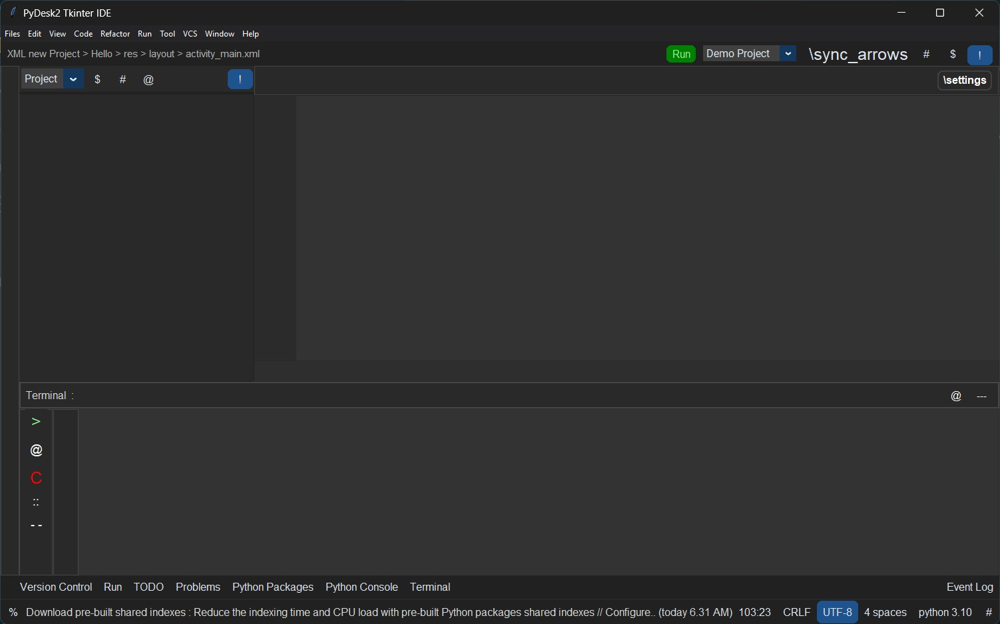
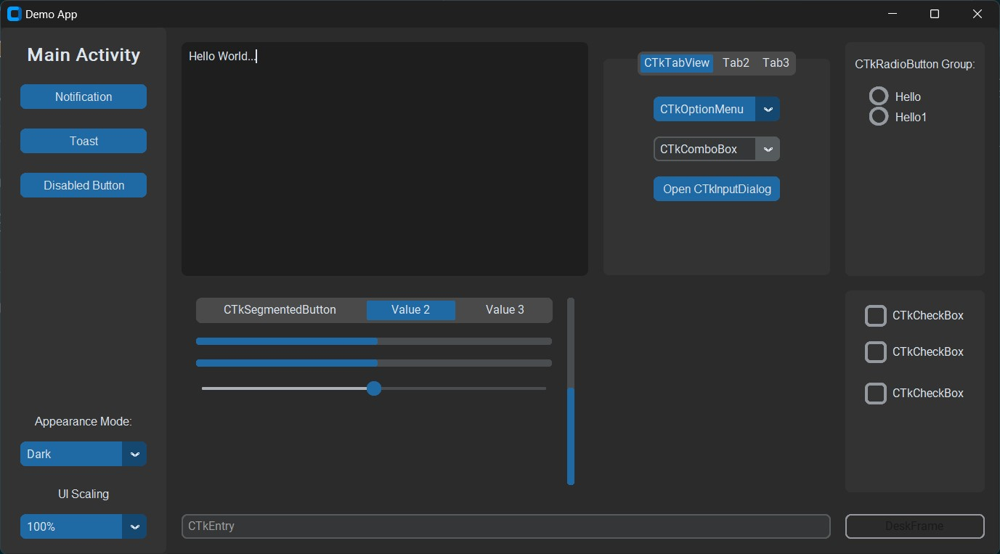
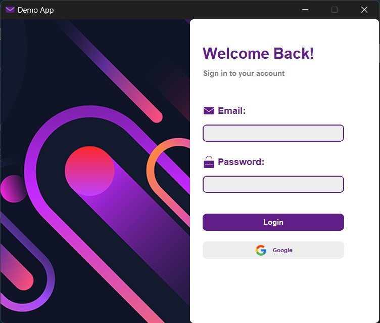

## Examples with DeskFrame
#### DeskFrame Application - Start DeskFrame World

#### VLC Media - full fetched video player

#### PyCharm-IDE - IDE UI

#### CTk Demo App - CTk UI

#### Login Window - Login UI with vertical align

